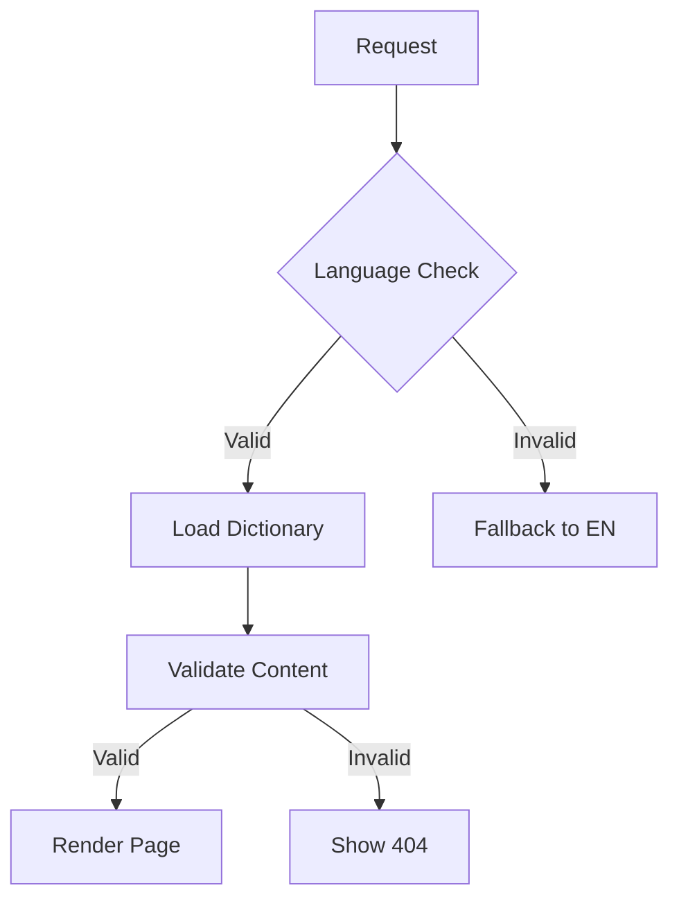
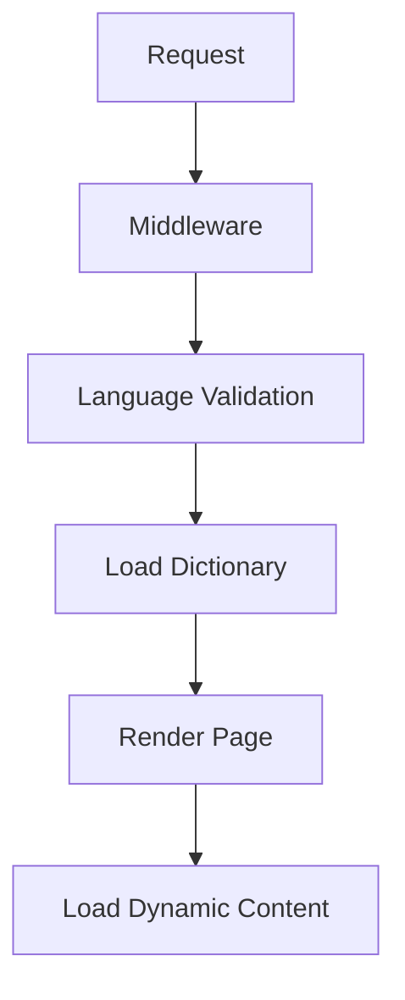

# TwoFifty Consulting Website

## Table of Contents

- [Architecture Overview](#architecture-overview)
- [Core Components](#core-components)
- [Internationalization](#internationalization)
- [Page Types](#page-types)
- [Blog System](#blog-system)
- [Development Guidelines](#development-guidelines)
- [Performance](#performance)
- [Deployment](#deployment)
- [Critical System Components](#critical-system-components)
- [Static Assets Handling](#static-assets-handling)
- [Troubleshooting](#troubleshooting)
- [Configuration](#configuration)
- [For AI Agents](#for-ai-agents-🤖)

## Prerequisites

- Node.js (v18.0.0 or higher)
- npm (v9.0.0 or higher)
- Git
- Basic knowledge of:
  - Next.js 13+
  - TypeScript
  - TailwindCSS
  - i18n concepts

## Architecture Overview

Built with Next.js 15+, TypeScript, and TailwindCSS, this multilingual website features:

- **Internationalization (i18n)** with English and French support
- **Static and Dynamic Pages** for optimal performance
- **Client/Server Component** separation
- **MDX-based Blog** system with tag support
- **SEO-optimized** dynamic routing

## Core Components

### Directory Structure

```plaintext
/app/
├── [lang]/                   # Language-specific routes
│   ├── about/               # Static pages
│   ├── blog/                # Blog system
│   │   ├── [slug]/         # Individual posts
│   │   └── tag/[tag]/      # Tag filtering
│   ├── education/          # Service pages
│   ├── manifest.json/      # Manifest route
│   └── layout.tsx          # Root layout
├── api/                     # API routes
├── components/             # Shared components
└── lib/                    # Utility functions
```

### Main Layout Implementation

```typescript
// filepath: /app/[lang]/layout.tsx
export default async function RootLayout(props: Props) {
  const { lang } = await getValidatedParams(props.params);
  const dictionary = await getDictionary(lang);

  return (
    <html lang={lang} className={`${inter.variable} ${geist.variable}`}>
      <body className="min-h-screen font-sans antialiased">
        <Header lang={lang} dictionary={dictionary} />
        {props.children}
        <Footer lang={lang} dictionary={dictionary} />
      </body>
    </html>
  );
}
```

## Internationalization

### Dictionary System

```typescript
// filepath: /lib/get-dictionary.ts
export async function getDictionary(locale: Locale) {
  try {
    const dictionary = await import(`@/dictionaries/${locale}.json`);
    return dictionary;
  } catch (error) {
    console.error(`Failed to load dictionary: ${locale}`, error);
    return await import(`@/dictionaries/en.json`); // Fallback to English
  }
}
```

### Parameter Validation

```typescript
// filepath: /lib/params-helper.ts
interface ValidatedParams {
  lang: Locale;
  slug?: string;
  [key: string]: string | undefined;
}

export async function getValidatedParams(
  params:
    | Record<string, string | undefined>
    | Promise<Record<string, string | undefined>>
): Promise<ValidatedParams> {
  try {
    const resolvedParams = await Promise.resolve(params);

    if (!resolvedParams || typeof resolvedParams !== "object") {
      notFound();
    }

    if (
      !resolvedParams.lang ||
      !i18n.locales.includes(resolvedParams.lang as Locale)
    ) {
      notFound();
    }

    return {
      ...resolvedParams,
      lang: resolvedParams.lang as Locale,
    };
  } catch (error) {
    console.error("Error validating params:", error);
    notFound();
  }
}
```

## Page Types

### Static Pages Example

```typescript
// filepath: /app/[lang]/about/page.tsx
export default async function AboutPage(props: Props) {
  const { lang } = await getValidatedParams(props.params);

  try {
    const dictionary = await getDictionary(lang);
    if (!dictionary.about) notFound();

    return (
      <main className="min-h-screen">
        <Hero {...dictionary.about.hero} />
        <Content {...dictionary.about.content} />
      </main>
    );
  } catch (error) {
    console.error("Failed to load about page:", error);
    notFound();
  }
}
```

### Dynamic Pages Example

#### Favicons in Layout:

```typescript
// filepath: /app/[lang]/blog/[slug]/page.tsx
import { generateFaviconMetadata } from "@/lib/favicon";

export async function generateMetadata({ params }: Props): Promise<Metadata> {
  const { lang, slug } = await getValidatedParams(params);
  const post = await getPostBySlug(slug, lang);
  const baseUrl = process.env.NEXT_PUBLIC_SITE_URL;

  return {
    ...generateFaviconMetadata(),
    title: post.title,
    description: post.excerpt,
    alternates: {
      canonical: `${baseUrl}/${lang}/blog/${slug}`,
      languages: {
        en: `/en/blog/${slug}`,
        fr: `/fr/blog/${slug}`,
      },
    },
  };
}
```

#### Key Considerations

- Static assets are served from the root path to avoid language prefix issues
- Middleware configuration excludes static asset paths from language routing
- Base URL handling differs between development and production environments
- Dynamic manifest generation supports language-specific PWA features

## Blog System

### Post Interface

```typescript
// filepath: /types/post.ts
interface Post {
  slug: string;
  title: string;
  date: string;
  excerpt: string;
  content: string;
  author: {
    name: string;
    image: string;
  };
  coverImage: string;
  tags: string[];
  featured?: boolean;
}
```

### MDX Implementation

```typescript
// filepath: /lib/blog.ts
import { compileMDX } from "next-mdx-remote/rsc";

export async function getPostBySlug(
  slug: string,
  locale: Locale
): Promise<Post> {
  const source = await fs.readFile(
    path.join(process.cwd(), "content", locale, `${slug}.mdx`),
    "utf8"
  );

  const { content, frontmatter } = await compileMDX({
    source,
    options: { parseFrontmatter: true },
  });

  return { ...frontmatter, slug, content };
}
```

## Development Guidelines

### Getting Started

```bash
# Install dependencies
npm install

# Set up environment variables
cp .env.example .env.local

# Start development server
npm run dev
```

### Testing

```bash
# Run unit tests
npm run test

# Run E2E tests
npm run test:e2e

# Run type checking
npm run type-check
```

### Common Issues and Solutions

1. **Dictionary Loading Failures**

   ```typescript
   if (!dictionary) {
     console.error("Dictionary failed to load");
     return <Error statusCode={500} />;
   }
   ```

2. **Image Optimization**
   ```typescript
   <Image
     {...props}
     placeholder="blur"
     blurDataURL="data:image/jpeg;base64,/9j/4AAQSkZJRg..."
   />
   ```

## Performance

### Image Component

```typescript
// filepath: /components/OptimizedImage.tsx
export default function OptimizedImage({
  src,
  alt,
  priority = false,
}: ImageProps) {
  return (
    <div className="relative aspect-[16/9]">
      <Image
        src={src}
        alt={alt}
        fill
        sizes="(max-width: 768px) 100vw, (max-width: 1200px) 50vw, 33vw"
        priority={priority}
        className="object-cover rounded-lg"
      />
    </div>
  );
}
```

### Font Configuration

```typescript
// filepath: /app/layout.tsx
import { Inter, Geist } from "next/font/google";

const inter = Inter({
  subsets: ["latin"],
  display: "swap",
  variable: "--font-inter",
});

const geist = Geist({
  subsets: ["latin"],
  display: "swap",
  variable: "--font-geist",
});
```

## Deployment

### Environment Setup

```plaintext
# filepath: /.env.example
NEXT_PUBLIC_SITE_URL=https://twofifty.co
NEXT_PUBLIC_GA_ID=GA-XXXXXXXXXX
SMTP_HOST=smtp.example.com
SMTP_PORT=587
SMTP_USER=your-email@example.com
SMTP_PASS=your-password
```

### Build and Deploy

```bash
# Clear cache and build
rm -rf .next
npm run build

# Start production server
npm run start

# Deploy to Vercel
vercel
```

## Critical System Components

### State Management

```typescript
// filepath: /lib/hooks/use-dictionary.ts
export function useDictionary() {
  const searchParams = useSearchParams();
  const lang = searchParams.get("lang") || "en";
  return useSWR(`/api/dictionary/${lang}`, getDictionary);
}
```

### Error Boundaries

```typescript
// filepath: /components/error-boundary.tsx
export default function ErrorBoundary({
  error,
  reset,
}: {
  error: Error & { digest?: string };
  reset: () => void;
}) {
  useEffect(() => {
    console.error(error);
  }, [error]);

  return (
    <div className="error-container">
      {error.digest === "NEXT_NOT_FOUND" ? (
        <NotFound />
      ) : (
        <Error500 reset={reset} />
      )}
    </div>
  );
}
```

### Dynamic Imports

```typescript
// filepath: /app/[lang]/workshops/page.tsx
const WorkshopCard = dynamic(() => import("@/components/WorkshopCard"), {
  loading: () => <WorkshopCardSkeleton />,
});
```

### Critical Path Considerations

#### 1. Dictionary Loading Priority

- Dictionary must load before any content rendering
- Fallback to English on failure
- Cache dictionary responses

```typescript
// filepath: /lib/dictionary-cache.ts
const DICTIONARY_CACHE = new Map<string, Promise<Dictionary>>();

export async function getCachedDictionary(locale: Locale) {
  if (!DICTIONARY_CACHE.has(locale)) {
    DICTIONARY_CACHE.set(locale, getDictionary(locale));
  }
  return DICTIONARY_CACHE.get(locale);
}
```

#### 2. Image Loading Strategy

```typescript
// filepath: /components/critical-image.tsx
export function CriticalImage({ src, alt }: ImageProps) {
  return (
    <Image src={src} alt={alt} priority={true} loading="eager" sizes="100vw" />
  );
}
```

### Security Considerations

```typescript
// filepath: /lib/security/validate-params.ts
export function validateAndSanitizeParams(params: unknown) {
  if (!params || typeof params !== "object") {
    throw new Error("Invalid params");
  }

  // Sanitize and validate all parameters
  return Object.entries(params).reduce(
    (acc, [key, value]) => ({
      ...acc,
      [key]: sanitize(value),
    }),
    {}
  );
}
```

### AI Model Considerations

#### 1. Important Patterns to Recognize

- All pages follow the `[lang]` parameter pattern
- Dictionary validation before content rendering
- Error boundaries at page level
- Image optimization patterns
- Dynamic imports for performance

#### 2. Critical Type Definitions

```typescript
// filepath: /types/core.ts
export interface CorePageProps {
  params: {
    lang: Locale;
  };
  searchParams?: { [key: string]: string | string[] | undefined };
}

export interface DictionarySection {
  meta: {
    title: string;
    description: string;
  };
  hero: {
    title: string;
    subtitle?: string;
  };
  content: Record<string, unknown>;
}
```

#### 3. Common Failure Points

- Dictionary loading failures
- Image optimization errors
- Dynamic import failures
- Invalid language parameters
- Missing content sections

#### 4. Performance Bottlenecks

- Dictionary loading time
- Image optimization
- Client-side navigation
- Font loading
- Third-party scripts

### Development Flow



### Critical Environment Variables

```plaintext
# filepath: /.env.example
# Critical for functionality
NEXT_PUBLIC_SITE_URL=https://twofifty.co
NEXT_PUBLIC_DEFAULT_LOCALE=en
NEXT_PUBLIC_SUPPORTED_LOCALES=en,fr

# Performance monitoring
NEXT_PUBLIC_PERFORMANCE_API_KEY=xxx
NEXT_PUBLIC_SENTRY_DSN=xxx

# Content delivery
NEXT_PUBLIC_CONTENT_API_URL=xxx
CONTENT_API_KEY=xxx
```

## Static Assets Handling

### Path Management for Multilingual Setup

The website uses special path handling for static assets to work correctly with language routing:

```typescript
// filepath: /lib/url.ts
export function getBaseUrl() {
  if (process.env.NODE_ENV === "development") {
    return "http://localhost:3000";
  }
  return process.env.NEXT_PUBLIC_BASE_URL || "https://twofifty.co";
}
```

```typescript
// filepath: /utils/getImagePath.ts
export function getImagePath(path: string) {
  // Remove any leading slashes and ensure clean path
  const cleanPath = path.replace(/^\//, "");
  return path.startsWith("http") ? path : `${getBaseUrl()}/${cleanPath}`;
}
```

```typescript
// filepath: /lib/favicon.ts
const getFaviconPath = (path: string) => {
  // Remove any leading slashes and ensure clean path
  const cleanPath = path.replace(/^\//, "");
  return path.startsWith("http") ? path : `${getBaseUrl()}/${cleanPath}`;
};

export function generateFaviconMetadata(): Metadata {
  return {
    metadataBase: new URL(getBaseUrl()),
    icons: {
      icon: [
        {
          url: getFaviconPath("favicon/favicon-16x16.png"),
          sizes: "16x16",
          type: "image/png",
        },
        {
          url: getFaviconPath("favicon/favicon-32x32.png"),
          sizes: "32x32",
          type: "image/png",
        },
      ],
      shortcut: getFaviconPath("favicon.ico"),
      apple: getFaviconPath("favicon/apple-touch-icon.png"),
    },
  };
}
```

### Middleware Configuration

```typescript
// filepath: /middleware.ts
export const config = {
  // Matcher ignoring static assets and API routes
  matcher: [
    "/((?!api|_next/static|_next/image|favicon.ico|favicon/|images/).*)",
  ],
};
```

### Directory Structure for Static Assets

```plaintext
public/
├── favicon.ico                # Root level favicon
├── manifest.json             # Root level manifest
├── favicon/                  # Favicon directory
│   ├── favicon-16x16.png
│   ├── favicon-32x32.png
│   └── apple-touch-icon.png
└── images/                   # Images directory
    ├── blog/
    ├── team/
    └── products/
```

### Manifest Route

#### Dynamic Manifest Generation

```typescript
// filepath: /app/[lang]/manifest.json/route.ts
export async function GET(
  request: Request,
  context: { params: { lang: Locale } }
) {
  try {
    const { lang } = await getValidatedParams(context.params);
    const baseUrl = getBaseUrl();

    const manifest = generateManifest({
      lang,
      baseUrl,
    });

    return NextResponse.json(manifest, {
      headers: {
        "Content-Type": "application/manifest+json",
        "Cache-Control": "public, max-age=3600",
      },
    });
  } catch (error) {
    return new NextResponse("Not Found", { status: 404 });
  }
}
```

### Image Component Usage

```typescript
import { getImagePath } from "@/utils/getImagePath";

<Image
  src={getImagePath("images/team/member.jpg")}
  alt="Team Member"
  width={300}
  height={300}
/>;
```

## Component Library

### Core Components

Each component follows this structure:

- Purpose
- Props interface
- Usage examples
- Notes on localization

Example:

```typescript
// Header Component
interface HeaderProps {
  lang: Locale;
  dictionary: Dictionary;
}
```

## Troubleshooting

### Common Issues

1. **Language Route Issues**

   - Symptom: 404 errors on language routes
   - Solution: Check middleware configuration and language validation

2. **Static Asset Loading**

   - Symptom: Images/favicons not loading
   - Solution: Verify path generation and middleware exclusions

3. **Build Errors**
   - Symptom: Type checking failures
   - Solution: Run `npm run type-check` and fix reported issues

## Configuration

Key configuration files:

- `next.config.js` - Next.js configuration
- `tailwind.config.js` - TailwindCSS settings
- `tsconfig.json` - TypeScript configuration
- `middleware.ts` - Route handling

## Contributing

1. Fork the repository
2. Create your feature branch: `git checkout -b feature/AmazingFeature`
3. Commit your changes: `git commit -m 'Add AmazingFeature'`
4. Push to the branch: `git push origin feature/AmazingFeature`
5. Open a Pull Request

## License

This project is licensed under the MIT License - see the [LICENSE.md](LICENSE.md) file for details.

## Project Structure

```bash
.
├── app/                 # Next.js app router
├── components/         # React components
├── lib/               # Utility functions
├── public/            # Static assets
├── styles/           # Global styles
└── types/            # TypeScript type
```

## For AI Agents 🤖

### Project Dependencies

```json
{
  "dependencies": {
    "next": "14.1.0",
    "react": "18.2.0",
    "typescript": "5.3.3",
    "tailwindcss": "3.4.1",
    "@vercel/analytics": "1.1.2",
    "framer-motion": "10.18.0",
    "next-mdx-remote": "4.4.1"
  }
}
```

### Architectural Decisions

1. **App Router Structure**

   - Using Next.js 14 App Router for better SEO and performance
   - Language-based routing with `[lang]` parameter
   - Server Components by default, Client Components marked with 'use client'

2. **Data Flow**



### Failure Scenarios & Recovery

1. **Dictionary Loading Failure**

```typescript
try {
  const dictionary = await getDictionary(lang);
  if (!dictionary) throw new Error("Dictionary not found");
} catch (error) {
  console.error(`Failed to load dictionary: ${error}`);
  return await getDictionary("en"); // Fallback to English
}
```

2. **Image Loading Failure**

```typescript
<Image
  src={getImagePath(src)}
  alt={alt}
  onError={(e) => {
    e.currentTarget.src = "/images/fallback.jpg";
  }}
/>
```

### State Management

1. **Server State**

   - Dictionary data loaded server-side
   - Blog posts and MDX content managed through filesystem
   - Environment variables for configuration

2. **Client State**
   - Navigation state managed by Next.js
   - UI state with React hooks
   - Animations with Framer Motion

### Testing Strategy

```typescript
// Component Testing Example
import { render, screen } from "@testing-library/react";

describe("Header", () => {
  it("renders navigation items", () => {
    render(<Header lang="en" dictionary={mockDictionary} />);
    expect(screen.getByText("About")).toBeInTheDocument();
  });
});
```

### Performance Optimization

1. **Image Optimization**

   - Next.js Image component with automatic optimization
   - WebP format support
   - Lazy loading for non-critical images

2. **Code Splitting**

```typescript
const DynamicComponent = dynamic(() => import("@/components/Heavy"), {
  loading: () => <Skeleton />,
  ssr: false,
});
```

### Error Handling Patterns

```typescript
// Global Error Handler
export function GlobalError({
  error,
  reset,
}: {
  error: Error & { digest?: string };
  reset: () => void;
}) {
  useEffect(() => {
    // Log to monitoring service
    console.error(error);
  }, [error]);

  return (
    <html>
      <body>
        <ErrorDisplay error={error} reset={reset} />
      </body>
    </html>
  );
}
```

### CI/CD Pipeline

```yaml
name: CI
on: [push, pull_request]
jobs:
  build:
    runs-on: ubuntu-latest
    steps:
      - uses: actions/checkout@v2
      - name: Install dependencies
        run: npm ci
      - name: Type check
        run: npm run type-check
      - name: Test
        run: npm test
      - name: Build
        run: npm run build
```

### Key File Locations

```plaintext
/app/
├── [lang]/                   # Language routes
│   ├── layout.tsx           # Root layout
│   └── page.tsx             # Home page
├── api/                     # API routes
└── global-error.tsx         # Error boundary

/lib/
├── blog.ts                  # Blog utilities
├── dictionary.ts            # i18n helpers
└── validation.ts            # Input validation

/components/
├── ui/                      # UI components
└── layout/                  # Layout components
```

## Version Information

```json
{
  "dependencies": {
    "next": "^15.1.7",
    "react": "18.2.0",
    "typescript": "5.3.3",
    "tailwindcss": "3.4.1",
    "@vercel/analytics": "1.1.2",
    "framer-motion": "10.18.0",
    "next-mdx-remote": "4.4.1"
  }
}
```

### Next.js 15 Features Used

- **App Router**: Enhanced routing system with improved performance
- **Server Actions**: Direct mutations from Server Components
- **Partial Prerendering**: Faster initial page loads
- **Metadata API**: Advanced SEO optimization
- **URL-Based Image Optimization**: Improved image handling
- **Server Components by Default**: Better performance and SEO

### Version-Specific Considerations

```typescript
// Example of Next.js 15 Server Action
"use server";

export async function submitForm(formData: FormData) {
  const rawData = Object.fromEntries(formData.entries());

  try {
    await processSeverSideData(rawData);
    revalidatePath("/");
  } catch (error) {
    throw new Error("Failed to submit form");
  }
}
```

### Breaking Changes from Next.js 14

1. **Metadata Updates**

```typescript
// New metadata API usage
export const metadata: Metadata = {
  metadataBase: new URL("https://twofifty.co"),
  alternates: {
    canonical: "/",
    languages: {
      en: "/en",
      fr: "/fr",
    },
  },
};
```

2. **Image Component Updates**

```typescript
// Updated Image component usage
<Image
  src={getImagePath("team/member.jpg")}
  width={300}
  height={300}
  alt="Team Member"
  priority={true}
/>
```

## URL and SEO Management

### Parameter Validation

```typescript
// filepath: /lib/params-helper.ts
interface ValidatedParams {
  lang: Locale;
  slug?: string;
  [key: string]: string | undefined;
}

export async function getValidatedParams(
  params:
    | Record<string, string | undefined>
    | Promise<Record<string, string | undefined>>
): Promise<ValidatedParams> {
  try {
    const resolvedParams = await Promise.resolve(params);

    if (!resolvedParams || typeof resolvedParams !== "object") {
      notFound();
    }

    if (
      !resolvedParams.lang ||
      !i18n.locales.includes(resolvedParams.lang as Locale)
    ) {
      notFound();
    }

    return {
      ...resolvedParams,
      lang: resolvedParams.lang as Locale,
    };
  } catch (error) {
    console.error("Error validating params:", error);
    notFound();
  }
}
```

### Metadata and Canonical URLs

```typescript
// filepath: /lib/metadata.ts
interface PageMetadataProps {
  lang: Locale;
  path?: string;
  title: string;
  description: string;
}

export function generatePageMetadata({
  lang,
  path = "",
  title,
  description,
}: PageMetadataProps): Metadata {
  const baseUrl = getBaseUrl();
  const canonicalPath = path ? `/${lang}${path}` : `/${lang}`;

  return {
    title,
    description,
    alternates: {
      canonical: `${baseUrl}${canonicalPath}`,
      languages: Object.fromEntries(
        i18n.locales.map((locale) => [locale, `${baseUrl}/${locale}${path}`])
      ),
    },
  };
}
```

### Implementation Examples

1. **Static Page**

```typescript
// filepath: /app/[lang]/about/page.tsx
export async function generateMetadata({ params }: Props): Promise<Metadata> {
  const { lang } = await getValidatedParams(params);

  return generatePageMetadata({
    lang,
    path: "/about",
    title: "About | TwoFifty Consulting",
    description: "About TwoFifty Consulting",
  });
}
```

2. **Blog Post**

```typescript
// filepath: /app/[lang]/blog/[slug]/page.tsx
export async function generateMetadata({ params }: Props): Promise<Metadata> {
  const { lang, slug } = await getValidatedParams(params);
  const post = await getPostBySlug(slug, lang);

  if (!post) return {};

  return generatePageMetadata({
    lang,
    path: `/blog/${slug}`,
    title: post.title,
    description: post.excerpt,
  });
}
```

3. **Dynamic Pages**

```typescript
// filepath: /app/[lang]/blog/tag/[tag]/page.tsx
export async function generateMetadata({ params }: Props): Promise<Metadata> {
  const { lang, tag } = await getValidatedParams(params);
  const dictionary = await getDictionary(lang);

  return generatePageMetadata({
    lang,
    path: `/blog/tag/${tag}`,
    title: `${tag} | ${dictionary.blog.tags}`,
    description: `${dictionary.blog.tagDescription} ${tag}`,
  });
}
```

### Common Issues and Solutions

1. **Missing Canonical Links**

```typescript
// Problem: Canonical links not appearing in head
// Solution: Ensure proper metadata base URL
export async function generateMetadata({ params }: Props): Promise<Metadata> {
  return {
    metadataBase: new URL(getBaseUrl()), // Add this line
    // ...rest of metadata
  };
}
```

2. **Wrong Language Alternates**

```typescript
// Problem: Language alternates showing wrong paths
// Solution: Use consistent path structure
const path = `/blog/${slug}`;
return {
  alternates: {
    canonical: `${baseUrl}/${lang}${path}`,
    languages: {
      en: `${baseUrl}/en${path}`,
      fr: `${baseUrl}/fr${path}`,
    },
  },
};
```

3. **404 on Language Routes**

```typescript
// Problem: Language routes returning 404
// Solution: Update middleware configuration
export const config = {
  matcher: [
    // Include all routes except static assets and API
    "/((?!api|_next/static|_next/image|favicon.ico|favicon/|images/).*)",
  ],
};
```

### SEO Best Practices

1. **Language Tags**

```typescript
// filepath: /app/[lang]/layout.tsx
export default function Layout({ params: { lang } }: Props) {
  return (
    <html lang={lang} dir={lang === "ar" ? "rtl" : "ltr"}>
      {/* ... */}
    </html>
  );
}
```

2. **Structured Data**

```typescript
// filepath: /lib/structured-data.ts
export function generateBlogPostSchema(post: Post, lang: Locale) {
  return {
    "@context": "https://schema.org",
    "@type": "BlogPosting",
    headline: post.title,
    datePublished: post.date,
    inLanguage: lang,
    // ...more fields
  };
}
```

### Canonical URLs and Metadata Generation

```typescript
// filepath: /lib/metadata.ts
import type { Metadata } from "next";
import type { Locale } from "@/i18n-config";
import { i18n } from "@/i18n-config";
import { getBaseUrl } from "./url";

interface PageMetadataProps {
  lang: Locale;
  path?: string;
  title: string;
  description: string;
}

export function generatePageMetadata({
  lang,
  path = "",
  title,
  description,
}: PageMetadataProps): Metadata {
  const baseUrl = getBaseUrl();
  const canonicalPath = path ? `/${lang}${path}` : `/${lang}`;

  return {
    title,
    description,
    metadataBase: new URL(baseUrl),
    alternates: {
      canonical: `${baseUrl}${canonicalPath}`,
      languages: Object.fromEntries(
        i18n.locales.map((locale) => [locale, `${baseUrl}/${locale}${path}`])
      ),
    },
  };
}
```

### Usage Examples

```typescript
// Example 1: Static Page
// filepath: /app/[lang]/about/page.tsx
export async function generateMetadata({ params }: Props): Promise<Metadata> {
  const { lang } = await getValidatedParams(params);
  const dictionary = await getDictionary(lang);

  return generatePageMetadata({
    lang,
    path: "/about",
    title: dictionary.about?.meta?.title || "About | TwoFifty Consulting",
    description:
      dictionary.about?.meta?.description || "About TwoFifty Consulting",
  });
}

// Example 2: Blog Post
// filepath: /app/[lang]/blog/[slug]/page.tsx
export async function generateMetadata({ params }: Props): Promise<Metadata> {
  const { lang, slug } = await getValidatedParams(params);
  const post = await getPostBySlug(slug, lang);

  if (!post) return {};

  return generatePageMetadata({
    lang,
    path: `/blog/${slug}`,
    title: post.title,
    description: post.excerpt,
  });
}
```

This generates proper canonical URLs like:

- `https://twofifty.co/en/about`
- `https://twofifty.co/fr/blog/getting-started`

With corresponding language alternates:

```html
<link rel="canonical" href="https://twofifty.co/en/about" />
<link rel="alternate" hreflang="en" href="https://twofifty.co/en/about" />
<link rel="alternate" hreflang="fr" href="https://twofifty.co/fr/about" />
<link rel="alternate" hreflang="de" href="https://twofifty.co/de/about" />
<link rel="alternate" hreflang="es" href="https://twofifty.co/es/about" />
```

## Page Headers

Our pages follow a consistent header style pattern. Here's how to implement it:

### Standard Page Header

```typescript
<section className="py-24 bg-gradient-to-r from-primary/10 to-primary/5">
  <div className="container mx-auto px-6">
    <p className="text-primary mb-4">{dictionary.page.subtitle}</p>
    <h1 className="text-5xl font-bold mb-8">{dictionary.page.title}</h1>
  </div>
</section>
```

### Header Components

1. **Container Structure**

   - Outer section: `py-24` for vertical padding
   - Gradient background: `bg-gradient-to-r from-primary/10 to-primary/5`
   - Inner container: `container mx-auto px-6`

2. **Typography**

   - Subtitle: `text-primary mb-4`
   - Main title: `text-5xl font-bold mb-8`

3. **Dictionary Structure**

```typescript
{
  "page": {
    "subtitle": "Optional overline text",
    "title": "Main Page Title"
  }
}
```

### Example Implementation

```typescript
export default async function PageName(props: Props) {
  const { lang } = await getValidatedParams(props.params);
  const dictionary = await getDictionary(lang);

  return (
    <main className="min-h-screen">
      <section className="py-24 bg-gradient-to-r from-primary/10 to-primary/5">
        <div className="container mx-auto px-6">
          <p className="text-primary mb-4">{dictionary.page.subtitle}</p>
          <h1 className="text-5xl font-bold mb-8">{dictionary.page.title}</h1>
        </div>
      </section>
      {/* Page content */}
    </main>
  );
}
```

### Customization Options

- Add additional elements like CTAs or breadcrumbs
- Modify background gradient intensity with opacity values
- Adjust spacing for specific page requirements

## Pages Version 2

Our enhanced page structure follows a more sophisticated composition with multiple structured sections. Here's the pattern used in pages like Retreats:

### Hero Section with Split Layout

```typescript
<section className="relative py-24 bg-gradient-to-r from-primary/10 to-primary/5">
  <div className="container mx-auto px-4">
    <div className="grid md:grid-cols-2 gap-12 items-center">
      <div>
        <span className="text-primary mb-4">{dictionary.heroSubtitle}</span>
        <h1 className="text-4xl md:text-5xl font-bold mb-6">
          {dictionary.heroTitle}
        </h1>
        <p className="text-xl mb-8">{dictionary.heroDescription}</p>
        <Button size="lg" className="mt-4">
          {dictionary.cta.buttonText}
        </Button>
      </div>
      <div>
        <Image
          src="/images/hero.jpg"
          alt="Hero Image"
          width={1080}
          height={720}
          className="rounded-lg shadow-lg"
          priority
        />
      </div>
    </div>
  </div>
</section>
```

### Content Section Pattern

Each content section follows this structure:

```typescript
<section className="py-16 [bg-gray-50]">
  <div className="container mx-auto px-4">
    <h2 className="text-3xl font-bold mb-12">{dictionary.section.title}</h2>
    {/* Content Grid */}
    <div className="grid md:grid-cols-[2,3,4] gap-8">
      {/* Section specific content */}
    </div>
  </div>
</section>
```

### Dictionary Structure

```typescript
{
  "page": {
    "heroSubtitle": "Overline text",
    "heroTitle": "Main Title",
    "heroDescription": "Description text",
    "sections": {
      "whatYouGet": {
        "title": "Section Title",
        "items": ["item1", "item2"]
      },
      "program": {
        "title": "Program Title",
        "days": [
          {
            "title": "Day 1",
            "activities": ["activity1", "activity2"]
          }
        ]
      }
    },
    "cta": {
      "title": "CTA Title",
      "buttonText": "Action Text"
    }
  }
}
```

### Section Types

1. **Split Content**

   ```typescript
   <div className="grid md:grid-cols-2 gap-12 items-center">
     <ContentSection />
     <ImageSection />
   </div>
   ```

2. **Grid Layout**

   ```typescript
   <div className="grid md:grid-cols-3 gap-8">
     {items.map((item) => (
       <GridItem key={item.id} {...item} />
     ))}
   </div>
   ```

3. **Feature List**
   ```typescript
   <div className="space-y-4">
     {features.map((feature) => (
       <div className="flex items-center space-x-3">
         <span className="text-primary">✓</span>
         <span>{feature}</span>
       </div>
     ))}
   </div>
   ```

### Common Components

1. **Section Container**

   ```typescript
   <section className="py-16 [bg-variant]">
     <div className="container mx-auto px-4">{children}</div>
   </section>
   ```

2. **Section Header**

   ```typescript
   <div className="text-center mb-12">
     <h2 className="text-3xl font-bold mb-4">{title}</h2>
     <p className="text-xl">{subtitle}</p>
   </div>
   ```

3. **CTA Section**
   ```typescript
   <section className="py-16 bg-primary text-white">
     <div className="container mx-auto px-4 text-center">
       <h2 className="text-3xl font-bold mb-4">{title}</h2>
       <p className="text-xl mb-8">{subtitle}</p>
       <Button size="lg" variant="secondary">
         {buttonText}
       </Button>
     </div>
   </section>
   ```

### Customization Options

- Background variants: `bg-gray-50`, `bg-white`, `bg-primary`
- Grid columns: `md:grid-cols-[2,3,4]`
- Spacing: `py-16`, `py-24`, `mb-8`, `gap-12`
- Typography: `text-4xl`, `text-3xl`, `text-xl`
- Image handling: `rounded-lg`, `shadow-lg`, `priority`

### Example Implementation

See the Retreats page for a complete implementation of this enhanced page structure.
